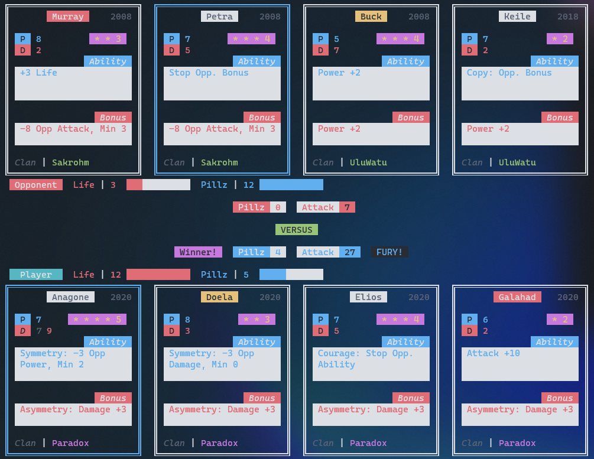

# UrbanRecreation — Rust

This is a Rust port of the [UrbanRecreation TypeScript engine](https://github.com/ArmaanAS/UrbanRecreation). It is exposed as a library so the engine and solvers can be tested and embedded without starting the original web server and command-line advisor.

The current parity engine reads the repository's canonical `data/` and `captures/` inputs
and fails closed on effects it has not implemented. The older engine still uses the
precompiled files under `assets/`; those files are an historical baseline, not a current
source of truth.

## Tests and historical baseline

From this directory, `cargo test --locked` runs the library foundation tests.
`cargo test --locked --all-features --all-targets` also builds and tests the legacy advisor target.
The asset test starts a child process in an empty temporary directory to verify that
card and ability loading does not depend on the caller's working directory.

The imported 10,000-game corpus is an archaeological record of the older TypeScript
engine, not server ground truth. Its aggregate diagnostic is ignored by default:

```sh
cargo test --release --locked --lib historical::tests::historical_release_baseline -- --ignored --exact --test-threads=1
```

This pins the imported Rust engine's release behavior: 9,061 games pass, 939 fail,
920 have resource mismatches, and 38 panic (these categories overlap). It continues
after mismatches and catches each game's panic. The fixture pins all failing case
indexes and a digest of 35,957 resolved rounds. Release mode matters because legacy
unsigned arithmetic behaves differently with debug overflow checks. The baseline
does not claim game-rule parity or validate solver decisions; future engine fixes
must review deliberate baseline changes against captured real games.

## Current experimental advisor

From the repository root, run the strict supported demo:

```sh
deno task rust:advise --plain
deno task rust:advise --interactive --plain
```

The same executable accepts exact card identities and levels:

```sh
cargo run --release --locked --manifest-path rust/Cargo.toml \
  --bin urban-recreation-advisor -- \
  --p1 123:1,124:1,138:1,139:1 \
  --p2 441:1,444:1,445:1,447:1 --plain
```

Run `deno task rust:advise --help` for first/second-mover, night, budget, interactive, and
terminal-size options. Construction goes through `CatalogCombatStatMatchV1`, so an
unsupported card effect produces an error instead of a plausible-looking wrong
recommendation. The search uses real engine make/unmake over every legal current-round
pairing and the TUI shows both the average and worst sampled result.

Interactive mode records resolved moves as `SLOT:PILLZ` or `SLOT:PILLZ:F`, alternates the
explicit first mover, and asks for the visible opposing card before second-mover searches.
Rounds 1–2 use the bounded position heuristic. Rounds 3–4 recursively solve exact terminal
win/draw/loss values with the conservative pure policy: one response may depend on the
opponent's visible card, but never on hidden pillz or Fury. Live capture, captured opening
weights, blind-second work, and round-2 continuation search remain to be ported.

## Historical engine usage

Define 2 hands of 4 cards, either from their names or card ids:

```Rust
use urban_recreation_rust::{card::Hand, game::Game};

let h1 = Hand::from_names("Anagone", "Doela", "Elios", "Galahad");
let h2 = Hand::from_names("Murray", "Petra", "Buck", "Keile");
```

Create the game struct:

```Rust
let mut game = Game::new(h1, h2);
```

Select the index of the card you want to play (0, 1, 2, 3), the number of pillz (0..=12) and if you want fury (true | false):

```Rust
// Player selects the 1st card with 4 pillz and fury.
game.select(0, 4, true);
// Opponent selects the 2nd card with no pillz or fury.
game.select(1, 0, false);
```

The game will print out to the console, the cards, player info and round info.



## Legacy advisor

The original Actix server and interactive command-line advisor are retained as the opt-in `legacy-advisor` feature. They are not built with the library by default.

### Command-line arguments

You can specify the names of the cards you want to play, first 4 names are your cards, next 4 names are the opponents card.

`cargo run --features legacy-advisor --bin urban-recreation-legacy -- Anagone Doela Elios Galahad Murray Petra Buck Keile`

If you want the Opponent to play first, pass any argument after the names:

`cargo run --features legacy-advisor --bin urban-recreation-legacy -- Anagone Doela Elios Galahad Murray Petra Buck Keile 1`

### Console input

When you start the game with cards specified in command line args, the console will wait for your input. Valid input formats:

> _`"0"`_  

Play card 0 (1st card on the left) with 0 pillz and no fury

> _`"1 4"`_  

Play 2nd card with 4 pillz and no fury

> _`"3 9 true"`_  

Play 4th card with 9 pillz and fury!

## Architecture

A game of Urban Rivals consists of 2 players battling with 4 cards each. The first player picks a card and some pillz and then the second player does the same. The cards will then battle. This is a single round. There can be upto 4 rounds.

In a round, once both players pick their card and pillz, the battle logic starts. All of the following data structures are used in the battle logic:

- `Game` - Contains all information related to a game of Urban Rivals. Cards, Players, ability Events.
- `Card` - Data related to a card, abilities, card stats, clan, is protected, is stopped, e.t.c.
- `Ability` - This contains data related to each ability. Ability / Bonus / Global type, Modifiers, Conditions.
- `Modifier` - This contains logic related to an ability which will apply an ability to the Cards / Players / Game. E.g. `-4 Life` results in:
  - `BasicModifier { change: 4, opp: true, stat: Life, won: true, ... }`
  - `opp: true` - Apply logic on Opponent
- `Condition` - This contains logic which effects the Modifiers to either stop them from applying if the condition is not met or even changes the logic of a Modifier, e.g. `Support:` condition will set the multiplier for `BasicModifier` to 4 if all cards in the hand are the same clan.
- `Events` - This stores a list of abilities of cards being played and global abilities like leader abilities. Each ability has an associated `event_time` which defines when in a round is the ability triggered. E.g. `-4 Life` has `event_time: EventTime::End` which will apply the ability's modifiers after the round has ended. E.g. `Copy Opp. Ability` is run at the start.
- `Player` - Contains life, pillz, Player / Opponent, did they win the round.

## License

<a href="https://rem.mit-license.org/">MIT License</a>
